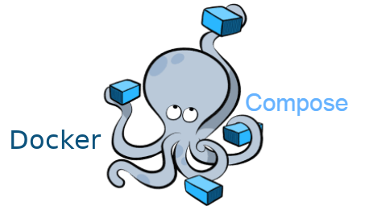

# Docker Engine & Docker Compose


## Basic Concepts

**Container:** A lightweight, standalone, and executable package that includes everything needed to run a piece of software.

**Image:**  Think of this as a template or blueprint for containers. It contains all the instructions needed to create a container.

**Docker Hub:** Like GitHub but for Docker images - it's where you can find and share container images.

**Docker Engine:** The core technology that runs and manages containers on your machine.


## Base commands:

```bash
docker info                   #how many containers, running, paused and stopped containers, images and server configuration
docker ps -a	              #show all docker containers
docker images	              #show local images 
docker search <>              #search image in registry (DockerHub)
docker pull <> 	              #download image from registry to localhost
docker build -t myimage . 	  #build image from Dockerfile
docker run <> 	              #run container
docker rm <> 	              #remove container
docker rmi <>	              #remove image
docker logs <> 	              #logs of container
docker start/stop/restart <>  #work with container
docker attach <>              #attach to runing container
docker inspect <>             #info about image or container
docker tag myimage:v1 myimage:copy	    #dublicate image with new tag
docker commit 6ew7ewe889s myimage:v2	#copy running container
docker exec -it 6re789eer /bin/bash	    #enter to container
```

>**Source:** https://docs.docker.com/reference/cli/docker/


## Advanced commands:

Run ubuntu container interactively & attached
```bash
docker run -it ubuntu /bin/bash
```

Run ubuntu container & and remove after stop
```bash
docker run --rm ubuntu 
```

Run in detached mode & ports forwarding from container 8080 to host 1234 
```bash
docker run -d -p 1234:8080 myimage 
```

Run detached with new name and REMOVE after exited
```bash
docker run --name container1 -d --rm myimage
```

Run with TimeZone environment
```bash
docker run --name container1 -e TZ=Europe/Kyiv myimage
```

Remove all containers by ID
```bash
docker rm -f $(docker ps -qa)
```

Build own Docker image
```bash
docker build -t myimage:v1 .
```

Remove all images by ID
```bash
docker rmi $(docker images -q)
```

Info about image
```bash
docker image history myimage
```

## Docker info

```bash
docker system info                #Displays system-wide information
docker system df                  #Shows Docker disk usage
docker system df -v               #Shows detailed information on space usage
docker ps -s                      #Displays total file sizes
docker status --no -stream        #Displays resource usage statistics
docker ps -f status=exited        #Shows exited containers
docker images -f dangling=true    #Shows unused images
docker volumes -ls dangling=true  #Shows unused volumes
```


## Storage Management


### Use BIND MOUNT
```bash
docker run -d -it --name nginx \
--mount type=bind,\
source=/home/example/nginxlogs,\
target=/var/log/nginx/,readonly \
-p 5050:80 \
nginx
```
---

### Use TMPFS
```bash
docker run -d -it --name nginx \
--mount type=tmpfs,\
target=/var/log/nginx/, 
tmpfs-mode=1770 
-p 5050:80 \
nginx
```
---


### Use VOLUMES

```bash
docker volume create newvolume
docker volume ls
docker volume inspect newvolume
docker run -it -v newvolume:/var/myproject ubuntu /bin/bash
docker volume rm newvolume
```
---


### Ephemeral (shared)
```bash
docker run -it -v /shared-data ubuntu bash         #first container
docker run -it --volumes-from 92b1g23 ubuntu bash  #second container
```

---


## Work with network


### Docker has the following default drivers:

Source: https://docs.docker.com/engine/network/drivers/

* **Bridge** is a default one. When you are running a container, it executes in the default network with the bridge driver. This is how your container can reach and can be reached from your side.

* **Host** means that instead of providing a virtual interface to the container, Docker will directly use a real Ethernet interface.

* **Overlay** connects multiple containers and enables swarm services to communicate with each other.

* **Macvlan** allows managing MAC addresses inside a container, making the container appear as a physical device on your network. It is sometimes the best choice when dealing with legacy applications that are supposed to be directly connected to a physical network rather than routed through the Docker host network stack.

* **Null** is meant for disabling all networking and is usually used in conjunction with a custom network driver.


### Docker default networks:

* **None network** 

This network, which uses the null driver, is a predefined network isolating container not to establish outgoing connections and communicate with other containers in the same host.

* **Host network**

If you want a container to run a similar networking configuration to the host machine, use the Host network.

* **Bridge network**

This is a default container network. Any network running without the --net flag will be automatically attached to Bridge. Furthermore, two Docker containers in this network can see each other.


### User-defined Bridge Network

Users can create user-defined custom bridge networks.

Let's consider some user-defined bridge network-related commands:

```bash
docker network ls
docker network inspect mynetwork                #displays detailed information
docker network create mynetwork                 #creates network
docker network connect mynetwork myimage        #connects container to network
docker network disconnect mynetwork myimage
docker network rm mynetwork                     #remove one or more networks

docker run --network mynetwork myimage          #basic example of use network
```


## Dockerfile


### Dockerfile reference

Source: https://docs.docker.com/reference/dockerfile/

| Instruction | Description |
| --- | --- |
|ADD	| Add *local* or *remote* files and directories.|
|ARG	| Use build-time variables.|
|CMD	| Specify default commands.|
|COPY	| Copy *local* files and directories.|
|ENTRYPOINT	| Specify default executable.|
|ENV	| Set environment variables.|
|EXPOSE	| Describe which ports your application is listening on.|
|FROM	| Create a new build stage from a base image.|
|HEALTHCHECK	| Check a container's health on startup.|
|LABEL	| Add metadata to an image.|
|MAINTAINER	|Specify the author of an image.|
|ONBUILD	| Specify instructions for when the image is used in a build.|
|RUN	| Execute build commands.|
|SHELL	| Set the default shell of an image.|
|STOPSIGNAL	| Specify the system call signal for exiting a container.|
|USER	| Set user and group ID.|
|VOLUME	| Create volume mounts.|
|WORKDIR	| Change working directory.|


* sample 1

```bash
FROM ubuntu:22.04

EXPOSE 80

ENV TZ=Europe/Kyiv
USER 1001

WORKDIR /var/httpd
COPY <source> <destination>
VOLUME ["/dir1","/dir2"] 

RUN apt update && apt install -y apache2
CMD ["",""]
ENTRYPOINT ["echo", "$VAR1"]
```

* sample 2

```bash
FROM python:3.10
WORKDIR /usr/src/app
EXPOSE 8000
COPY requirements.txt .
RUN pip3 install -qr requirements.txt
COPY app.py .
CMD ["python3", "app.py"]
```


* sample 3 (Multi-stage builds)

Source: https://docs.docker.com/build/building/multi-stage/


```bash
FROM golang:1.24 AS build
WORKDIR /src
COPY <<EOF /src/main.go
package main

import "fmt"

func main() {
  fmt.Println("hello, world")
}
EOF
RUN go build -o /bin/hello ./main.go

FROM scratch
COPY --from=build /bin/hello /bin/hello
CMD ["/bin/hello"]
```


# Docker Compose



Source: https://docs.docker.com/compose/

## Docker Compose CLI versioning

Version one of the **Docker Compose** command-line binary was first released in 2014. It was written in Python, and is invoked with **docker-compose**. Typically, Compose **v1** projects include a top-level version element in the compose.yaml file, with values ranging from 2.0 to 3.8, which refer to the specific file formats.

Version two of the **Docker Compose** command-line binary was announced in 2020, is written in Go, and is invoked with **docker compose**. Compose **v2** *ignores the version top-level element in the compose.yaml file*.


How to: https://medium.com/rate-engineering/using-docker-containers-to-run-a-distributed-application-locally-eeabd360bca3


## Commands
```bash
docker-compose up -d    #run in detached mode
docker-compose down     #stop and remove containers
docker-compose start/stop/restart
docker-compose exec     #runs arbitrary commands in the service

docker-compose ps       #lists containers
docker-compose port     #prints the public port for a port binding
docker-compose top      #displays the running processes
docker-compose logs     #views output from containers
docker-compose images   #lists images used by the created containers

docker-compose build    #builds or rebuilds services
docker-compose config   #validates and views the compose file

docker-compose pull     #pulls service images
docker-compose push     #pushes service images
```


* **SAMPLE 1:** Adjust Wordpress running on Apache web-server and using a standalone MySQL container as a database.

### Dockerfile

```bash
FROM wordpress:latest
COPY wp-config.php /var/www/html/wp-config.php
RUN chown www-data:www-data /var/www/html/wp-config.php   #wp-config.php file is owned by root initially. Its owner and owner's group should be www-data inside the container for Wordpress to work properly
EXPOSE 80
```


### wp-config.php

```php
<?php
/**
 * The base configuration for WordPress
 *
 * The wp-config.php creation script uses this file during the installation.
 * You don't have to use the web site, you can copy this file to "wp-config.php"
 * and fill in the values.
 *
 * This file contains the following configurations:
 *
 * * Database settings
 * * Secret keys
 * * Database table prefix
 * * ABSPATH
 *
 * @link https://wordpress.org/support/article/editing-wp-config-php/
 *
 * @package WordPress
 */

// ** Database settings - You can get this info from your web host ** //
/** The name of the database for WordPress */
define( 'DB_NAME', 'wordpress' );

/** Database username */
define( 'DB_USER', 'wordpress' );

/** Database password */
define( 'DB_PASSWORD', 'wordpress' );

/** Database hostname */
define( 'DB_HOST', 'my-awesome-database:3306' );

/** Database charset to use in creating database tables. */
define( 'DB_CHARSET', 'utf8mb4' );

/** The database collate type. Don't change this if in doubt. */
define( 'DB_COLLATE', '' );
/**#@+
 * Authentication unique keys and salts.
 *
 * Change these to different unique phrases! You can generate these using
 * the {@link https://api.wordpress.org/secret-key/1.1/salt/ WordPress.org secret-key service}.
 *
 * You can change these at any point in time to invalidate all existing cookies.
 * This will force all users to have to log in again.
 *
 * @since 2.6.0
 */
define( 'AUTH_KEY',         'put your unique phrase here' );
define( 'SECURE_AUTH_KEY',  'put your unique phrase here' );
define( 'LOGGED_IN_KEY',    'put your unique phrase here' );
define( 'NONCE_KEY',        'put your unique phrase here' );
define( 'AUTH_SALT',        'put your unique phrase here' );
define( 'SECURE_AUTH_SALT', 'put your unique phrase here' );
define( 'LOGGED_IN_SALT',   'put your unique phrase here' );
define( 'NONCE_SALT',       'put your unique phrase here' );

/**#@-*/

/**
 * WordPress database table prefix.
 *
 * You can have multiple installations in one database if you give each
 * a unique prefix. Only numbers, letters, and underscores please!
 */
$table_prefix = 'wp_';

/**
 * For developers: WordPress debugging mode.
 *
 * Change this to true to enable the display of notices during development.
 * It is strongly recommended that plugin and theme developers use WP_DEBUG
 * in their development environments.
 *
 * For information on other constants that can be used for debugging,
 * visit the documentation.
 *
 * @link https://wordpress.org/support/article/debugging-in-wordpress/
 */
define( 'WP_DEBUG', false );

/* Add any custom values between this line and the "stop editing" line. */


/* That's all, stop editing! Happy publishing. */

/** Absolute path to the WordPress directory. */
if ( ! defined( 'ABSPATH' ) ) {
        define( 'ABSPATH', __DIR__ . '/' );
}

/** Sets up WordPress vars and included files. */
require_once ABSPATH . 'wp-settings.php';

```


### docker-compose.yml

```yaml
version: "3.9"

networks:
  my-awesome-network:
    driver: bridge

volumes:
  wordpress:
  mysql:

services:
  my-awesome-database:
    image: mysql:5.7
    container_name: my-awesome-database
    restart: unless-stopped
    environment:
      MYSQL_ROOT_PASSWORD: ${MYSQL_ROOT_PASSWORD:-rootpass}
      MYSQL_DATABASE: ${MYSQL_DATABASE:-wordpress}
      MYSQL_USER: ${MYSQL_USER:-wordpress}
      MYSQL_PASSWORD: ${MYSQL_PASSWORD:-wordpress}
    volumes:
      - mysql:/var/lib/mysql
    networks:
      - my-awesome-network
    healthcheck:
      test: ["CMD", "mysqladmin", "ping", "-h", "127.0.0.1", "-uroot", "-prootpassword"]
      interval: 10s
      timeout: 5s
      retries: 5
  my-awesome-wordpress:
    build:
      context: .
      dockerfile: Dockerfile
    image: my-awesome-wordpress:latest
    container_name: my-awesome-wordpress
    depends_on:
      my-awesome-database:
        condition: service_healthy
    restart: unless-stopped
    ports:
      - "8080:80"   # http://VM_IP_ADDRESS:8080
    environment:
      WORDPRESS_DB_HOST: my-awesome-database:3306
      WORDPRESS_DB_NAME: ${MYSQL_DATABASE:-wordpress}
      WORDPRESS_DB_USER: ${MYSQL_USER:-wordpress}
      WORDPRESS_DB_PASSWORD: ${MYSQL_PASSWORD:-wordpress}
    networks:
      - my-awesome-network
    volumes:
      - wordpress:/var/www/html

```


* **SAMPLE 2:** Multistage Dockerfile with Spring web-app and database hlebsur/mysql:8 image.


### Dockerfile

```bash
FROM hlebsur/pet_clinic_not_full:latest AS build

FROM eclipse-temurin:17-jre-jammy AS production
EXPOSE 8080
COPY --from=build /app/target/spring-petclinic-*.jar /spring-petclinic.jar
CMD ["java", "-Djava.security.egd=file:/dev/./urandom", "-jar", "/spring-petclinic.jar"]
HEALTHCHECK --start-period=1m CMD curl -f http://localhost:8080/ || exit 1
```


### docker-compose.yml

```yaml
services:
  petclinic:
    build:
      context: .
      dockerfile: Dockerfile
    ports:
      - 8080:8080
    environment:
      - SERVER_PORT=8080
      - MYSQL_URL=jdbc:mysql://mysqlserver/petclinic
    volumes:
      - ./:/app
    depends_on:
      - mysqlserver
    networks:
      - petclinic

  mysqlserver:
    image: hlebsur/mysql:8
    ports:
      - 3306:3306
    environment:
      - MYSQL_DATABASE=petclinic
      - MYSQL_ROOT_PASSWORD=
      - MYSQL_ALLOW_EMPTY_PASSWORD=true
      - MYSQL_USER=petclinic
      - MYSQL_PASSWORD=petclinic
    volumes:
      - mysql_data:/var/lib/mysql
      - mysql_config:/etc/mysql/conf.d
    networks:
      - petclinic

volumes:
  mysql_data:
  mysql_config:

networks:
  petclinic:
```


### Build

```bash
docker compose up -d --build
```


# DockerHub 

* Sing up & create repos (https://hub.docker.com/)

* Create token and login:		docker login -u vvborys

* Build image with name and tag: 	docker build -t vvborys/ub20apache:v1 .

* Re-tagging an existing local image docker tag <existing-image> <hub-user>/<repo-name>[:<tag>]

* Push image:				docker push vvborys/ub20apache:v1

* Pull exising image:			docker pull vvborys/ub20apache:v1


# Info

* https://www.youtube.com/watch?v=3c-iBn73dDE
* https://docs.docker.com/engine/install/ubuntu/
